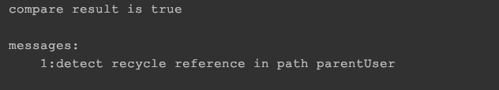
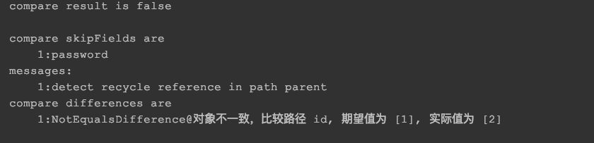

# obj-compare
Compare two objects and return the diffs.

# 使用示例

## 简单比较对象

###  示例代码
```java
@Test
public void testCompareResurive() {
    UserV2 user = new UserV2();
    UserV2 parentUser = new UserV2();

    user.setParentUser(parentUser);
    parentUser.setParentUser(user);

    user.setPassword("122");
    user.setUsername("21212");
    parentUser.setPassword("122");
    parentUser.setUsername("21212");

    CompareResult compareResult = CompareObjectUtils.compare(user, parentUser);
    System.out.println(compareResult);
}

```

### 结果输出


## 忽略某些字段比较

### 示例代码
```java
@Test
public void testCompareObj() {
    User expect = new User();
    expect.setId("1");
    expect.setPassword("111212");
    expect.setUsername("278821");
    expect.setSex("male");

    Parent parent = new Parent();
    parent.setType("mother");
    parent.setName("tom");
    List<Integer> f1 = new ArrayList<>();
    f1.add(1);
    f1.add(2);
    f1.add(3);
    parent.setFeatures(f1);

    expect.setParent(parent);

    //////////////////////////////////////////////

    User target = new User();
    target.setId("2");
    target.setPassword("1112112");
    target.setUsername("278821");
    target.setSex("male");

    parent = new Parent();
    parent.setType("father");
    parent.setName("tom");
    List<Integer> f2 = new ArrayList<>();
    f2.add(1);
    f2.add(3);
    f2.add(5);
    parent.setFeatures(f2);


    target.setParent(parent);

    List<IgnoreField> ignoreFields = new ArrayList<>();
    // 忽略类型为String.class 字段名为password的 属性比较
    ignoreFields.add(new IgnoreField("password", String.class));

    // 忽略任何以word结尾的属性，类型为任意类型
    IgnorePatternField ignorePatternField = new IgnorePatternField("[\\s\\d]*word");

    CompareResult result = CompareObjectUtils.compare(expect, target, ignoreFields);
    System.out.println(result);
}
```

### 结果输出
